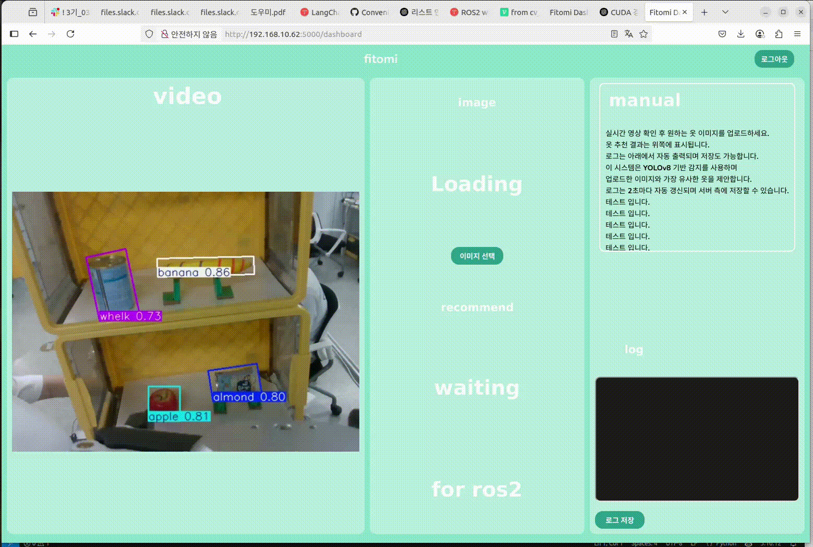

# Fitomi_Assist_AI_Cobot

### ROKEY 3기 AI 기반 협동 로봇 작업 어시스트 구현 프로젝트
- 프로젝트 기간: 2025.06.09 - 2025.06.20 (12일)
- 참여인원: 4명

<br>

## 🎥 프로젝트 소개
[](https://youtu.be/7lKyawi-X6o)
  ➡ 영상 클릭 시, youtube 재생


**Fitomi**(핏오미)는 협동로봇을 활용해 **개인 맞춤형 식단 추천 및 의류 추천부터 전달까지 서비스를 제공하는 AI 기반 시스템**입니다.

- **Doosan M0609 협동로봇**, **Realsense 카메라**, **OBB 기반 YOLO 객체 탐지**, **Flask 웹 서버**, **ROS2 Humble** 기반
- **STT**과 **TTS**를 통해 쉬운 사용자 인터페이스 제공

<br>

## 🔧 주요 기능

- 🥗 냉장고 내 식재료 인식 → 부족한 영양소 분석 및 식단 추천


- 👕 옷장 스캔 및 의류 감지 → 날씨/상황 기반 옷 추천


- 🤖 Doosan M0609 협동로봇을 통한 물건 전달
- 🎙️ STT/TTS 기반 사용자 인터페이스
- 🌐 Flask 기반 웹 UI 제공



<br>

## 🚀 전체 실행 순서

📦 파일 다운로드
```
mkdir ~/Fitomi_Assist_AI_Cobot/
cd ~/Fitomi_Assist_AI_Cobot/
git clone https://github.com/checkjunghyeon/Fitomi_Assist_AI_Cobot.git

cd ~/Fitomi_Assist_AI_Cobot/src
git clone –b humble https://github.com/ROKEY-SPARK/DoosanBootcamp3rd.git # 두산 로봇 ROS2 패키지 Git 주소
cd ..
colcon build --symlink-install
```

<br>

✅ **(1) Flask 서버 실행**

```
cd ~/Fitomi_Assist_AI_Cobot/src/fitomi_flask/
source ~/Fitomi_Assist_AI_Cobot/install/setup.bash
python3 fitomi_flask.py
```

<br>

✅ **(2) Doosan 로봇 Bringup**
```
cd ~/Fitomi_Assist_AI_Cobot/src/DoosanBootcamp3rd/
export PYTHONPATH=$PYTHONPATH:~/ros2_ws/install/dsr_common2/lib/dsr_common2/imp
source install/setup.bash
```

#### 🔘 아래 명령어 중 환경에 맞춰 선택(실로봇 vs 시뮬레이션)

**실로봇 버전**
```
ros2 launch dsr_bringup2 dsr_bringup2_rviz.launch.py \
  mode:=real host:=192.168.1.100 port:=12345 model:=m0609
```

**시뮬레이션 버전**
```
ros2 launch dsr_bringup2 dsr_bringup2_moveit.launch.py \
  mode:=virtual host:=127.0.0.1 port:=12345 model:=m0609
```
<br>

✅ **(3) 시스템 런치 실행**
```
cd ~/Fitomi_Assist_AI_Cobot/
source install/setup.bash

ros2 launch fitomi fitomi_system.launch.py
```
아래 노드 자동 실행:
  * Flask 서버 (웹 UI)
  * Realsense 카메라 런치
  * Task Manager (tm)
  * Context Manager (cm)
  * Object Detection (object_detect)
  * (옵션) 이미지 디스플레이 (img_display, 필요시 런치파일에서 주석 해제)

<br>

**➕ 디버깅/보조 명령어**
- 현재 로봇 위치 확인
```
ros2 run rokey get_current_pos
```
- 로봇 수동 제어 모드 설정
```
ros2 service call /dsr01/system/set_robot_mode dsr_msgs2/srv/SetRobotMode "robot_mode: 0"
```
- Flask 대신 수동 이미지 디스플레이
```
ros2 run my_handy img_display
```
